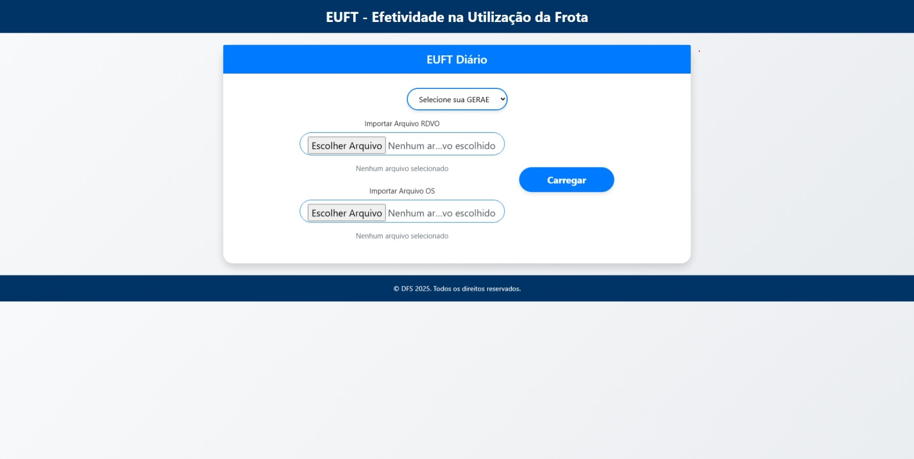

# 🚚 EUFT - Efetividade na Utilização da Frota

Aplicação web desenvolvida em **Flask (Python)** para cálculo da **Efetividade na Utilização da Frota de Transporte (EUFT)**, permitindo o upload e análise de arquivos RDVO e OS, filtragem por região (GERAE), exibição de resultados, inconsistências, veículos sem saída ou sem retorno, e geração de relatórios em formato CSV/Excel.

---

## 🖥️ Tela Inicial

<p align="center">
  
</p>

---

## 🚀 Acesso à Aplicação

A aplicação está disponível publicamente em:  
👉 **[https://euft2.onrender.com](https://euft2.onrender.com)**

---

## ⚙️ Funcionalidades Principais

- 📂 Upload de dois arquivos:  
  - **RDVO** (Registro Diário de Veículos Operacionais)  
  - **OS** (Ordem de Serviço)

- 🏙️ Seleção da **Região (GERAE)** para análise
- 📊 Cálculo automático do **EUFT Diário**
- ✅ Exibição de:
  - Resultados por **placa** e **lotação patrimonial**
  - Resultados consolidados **por unidade**
  - **Inconsistências** detectadas no processamento
  - **Veículos sem saída** e **sem retorno**
  - **Déficit diário por lotação**
- 📈 Geração de **gráficos interativos** de erros por unidade
- 💾 Exportação de resultados e erros em **CSV** e **Excel**
- 📋 Tabelas dinâmicas com **DataTables (busca, filtro e ordenação)**

---

## 🧩 Tecnologias Utilizadas

| Camada | Tecnologia |
|--------|-------------|
| Backend | Flask (Python) |
| Frontend | HTML5, CSS3, Bootstrap 4 |
| Tabelas e Interatividade | jQuery, DataTables |
| Gráficos | Chart.js com plugin de zoom |
| Deploy | Render.com |
| Exportação de Dados | Pandas e openpyxl |

---

## 📄 Estrutura de Pastas

```bash
EUFT/
│
├── static/
│   └── styles.css                # Estilos personalizados
│
├── templates/
│   └── index.html                # Interface principal
│
├── placas.py                     # Listas de placas por região
├── app.py                        # Código principal da aplicação Flask
├── imagem1.jpeg                  # Imagem da tela inicial
├── requirements.txt              # Dependências do projeto
└── README.md                     # Este arquivo
```

---

## 🧠 Passo a Passo de Uso

1. Acesse o link da aplicação:  
   👉 [https://euft2.onrender.com](https://euft2.onrender.com)

2. Na tela inicial:
   - Escolha sua **GERAE (Região)** no seletor.
   - Faça upload dos arquivos **RDVO** e **OS**.
   - Clique em **Carregar**.

3. Aguarde o processamento. A barra de progresso indicará quando o sistema estiver trabalhando.

4. Após o processamento:
   - Utilize os botões para visualizar:
     - **Resultados**  
     - **Erros / Inconsistências**  
     - **Gráfico de Impacto**  
     - **Veículos Sem Saída**  
     - **Veículos Sem Retorno**

5. Clique nos botões de **exportação (CSV/Excel)** quando disponíveis.

6. Navegue pelas tabelas com filtros e paginação automáticos.

---

## 📦 Como Executar Localmente

Se desejar rodar o sistema no seu próprio ambiente:

### 1. Clone o repositório

```bash
git clone https://github.com/seuusuario/euft.git
cd euft
```

### 2. Crie um ambiente virtual (opcional)

```bash
python -m venv venv
source venv/bin/activate   # Linux/Mac
venv\Scripts\activate      # Windows
```

### 3. Instale as dependências

```bash
pip install -r requirements.txt
```

### 4. Execute a aplicação

```bash
python app.py
```

Acesse no navegador:  
👉 **http://127.0.0.1:5000**

---

## 🧮 Cálculo do EUFT

O sistema calcula o **EUFT** (Efetividade na Utilização da Frota de Transporte) como:


EUFT = {Lançamentos Corretos}/{Lançamentos Totais} + {Adicional}


Cada **dia** e **placa** são analisados individualmente.  
Os lançamentos são verificados quanto a:
- Tempo de uso (saída/retorno)
- Distância percorrida
- Coerência entre registros de RDVO e OS
- Presença ou ausência de retorno

---

## 📬 Contato

Desenvolvido por **Douglas Francisco da Silva**  
📧 [d3lsempre@gmail.com]  
💼 [www.linkedin.com/in/douglas-francisco-da-silva-51953435a]

---

© DFS 2025 — Todos os direitos reservados.
